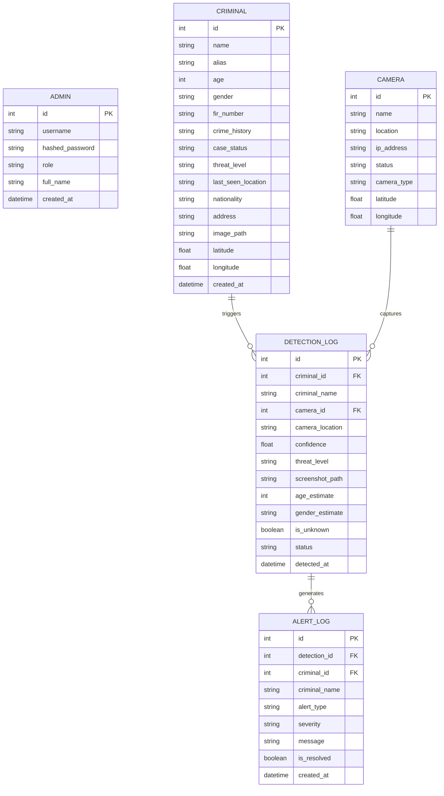

# Database Schema & Entity Relationship — CFCS v2.0

## Entity Relationship Summary

The database is built on SQLAlchemy with SQLite / PostgreSQL support. It models administrators, authorized personnel, criminal database records, surveillance camera feeds, detection event logs, alert notifications, and ARIA AI query sessions.

## Table Definitions

### 1. `admins`
| Column | Type | Constraints | Description |
|--------|------|-------------|-------------|
| `id` | Integer | Primary Key | Unique user ID |
| `username` | String | Unique, Indexed | Account login ID |
| `hashed_password` | String | Not Null | Bcrypt hashed passkey |
| `role` | String | Default: 'admin' | admin / officer / investigator / operator |
| `full_name` | String | Not Null | Officer full name |

### 2. `criminals`
| Column | Type | Description |
|--------|------|-------------|
| `id` | Integer | Primary Key |
| `name` | String | Primary criminal full name |
| `alias` | String | Known street alias |
| `fir_number` | String | Unique FIR Police Case # |
| `threat_level` | String | Low / Medium / High / Critical |
| `case_status` | String | Active / Wanted / Arrested / Closed |
| `latitude` / `longitude` | Float | Spatial coordinate for heatmap |

### 3. `detection_logs`
| Column | Type | Description |
|--------|------|-------------|
| `id` | Integer | Primary Key |
| `criminal_id` | Integer | FK to `criminals.id` (NULL if unknown) |
| `confidence` | Float | Face match confidence % (e.g. 98.5) |
| `screenshot_path` | String | Local file path to captured frame |
| `detected_at` | DateTime | Timestamp of event |
